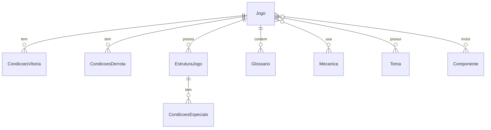

# 🏗 Arquitetura do BGCreator

## Visão Geral

O BGCreator é uma aplicação modular baseada em microserviços containerizados, seguindo uma arquitetura de 3 camadas:

```
┌─────────────────┐    ┌─────────────────┐    ┌─────────────────┐
│   Frontend      │    │    Backend      │    │   Database      │
│   (Django Web)  │◄──►│   (Django API)  │◄──►│   (MongoDB)     │
│   Port: 8000    │    │   Port: 8001    │    │   Port: 27017   │
└─────────────────┘    └─────────────────┘    └─────────────────┘
```

## Componentes

### 1. Frontend (Django Web)
- **Responsabilidade**: Interface do usuário e experiência visual
- **Tecnologia**: Django Templates + Bootstrap 5
- **Porta**: 8000
- **Funcionalidades**:
  - Renderização de páginas HTML
  - Formulários interativos
  - Consumo da API REST
  - Upload de arquivos

### 2. Backend (Django API)
- **Responsabilidade**: Lógica de negócio e API REST
- **Tecnologia**: Django REST Framework
- **Porta**: 8001
- **Funcionalidades**:
  - CRUD completo para todas as entidades
  - Cálculo automático de peso/complexidade
  - Validações de negócio
  - Serialização de dados
  - Filtros e buscas avançadas

### 3. Database (MongoDB)
- **Responsabilidade**: Persistência de dados
- **Tecnologia**: MongoDB 7.0
- **Porta**: 27017
- **Características**:
  - Banco NoSQL para flexibilidade
  - Suporte a documentos complexos
  - Escalabilidade horizontal

## Modelo de Dados

### Entidades Principais



### Cálculo de Peso (Complexidade)

O sistema calcula automaticamente o peso do jogo baseado na fórmula:

```
Peso = P_tempo + P_mecanica + P_componentes + P_vitoria + P_derrota + P_estrutura + P_especial
```

| Categoria | Incremento | Limite Máximo |
|-----------|------------|---------------|
| Tempo Médio | +0,1 a cada 30min | 1,0 |
| Mecânicas | +0,1 por mecânica | 1,0 |
| Componentes | +0,1 por componente | 1,0 |
| Cond. Vitória | +0,1 por condição | 0,3 |
| Cond. Derrota | +0,1 por condição | 0,3 |
| Estruturas | +0,1 por fase/ação | 1,0 |
| Cond. Especiais | +0,1 por condição | 0,5 |

## Fluxo de Dados

### 1. Criação de Jogo
```
Frontend → API POST /jogos/ → Validação → MongoDB → Cálculo Peso → Response
```

### 2. Busca de Jogos
```
Frontend → API GET /jogos/buscar/?q=termo → MongoDB Query → Filtros → Response
```

### 3. Upload de Imagem
```
Frontend → API POST (multipart) → Validação → File System → MongoDB (path) → Response
```

## Padrões Arquiteturais

### 1. Repository Pattern
- Models abstraem o acesso aos dados
- ViewSets encapsulam a lógica de apresentação
- Serializers fazem a transformação de dados

### 2. RESTful API
- Endpoints padronizados (GET, POST, PUT, DELETE)
- Status codes HTTP apropriados
- Paginação automática
- Filtros e ordenação

### 3. Separation of Concerns
- Frontend: apenas apresentação
- Backend: lógica de negócio
- Database: persistência

## Segurança

### 1. CORS
- Configurado para permitir apenas origens conhecidas
- Headers de segurança implementados

### 2. Validação
- Validação de entrada em todos os endpoints
- Sanitização de uploads de arquivo
- Limites de tamanho de arquivo

### 3. Autenticação (Futuro)
- JWT tokens
- Roles e permissões
- Rate limiting

## Escalabilidade

### 1. Horizontal
- Containers Docker independentes
- Load balancer (futuro)
- Database sharding (futuro)

### 2. Vertical
- Otimização de queries
- Cache Redis (futuro)
- CDN para assets (futuro)

## Monitoramento

### 1. Logs
- Logs estruturados em JSON
- Diferentes níveis (DEBUG, INFO, ERROR)
- Rotação automática

### 2. Métricas (Futuro)
- Prometheus + Grafana
- Health checks
- Performance monitoring

## Deploy

### 1. Desenvolvimento
```bash
docker-compose up --build
```

### 2. Produção (Futuro)
- Kubernetes
- CI/CD Pipeline
- Blue-Green Deployment